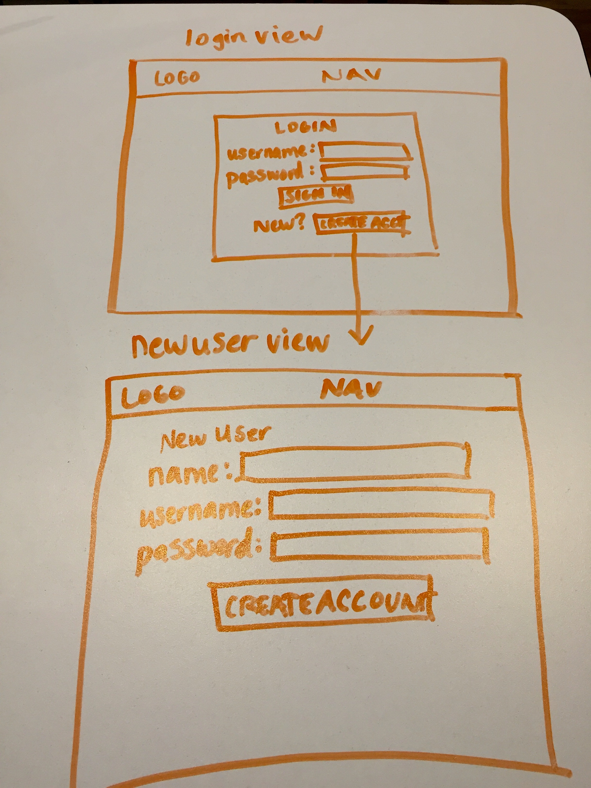
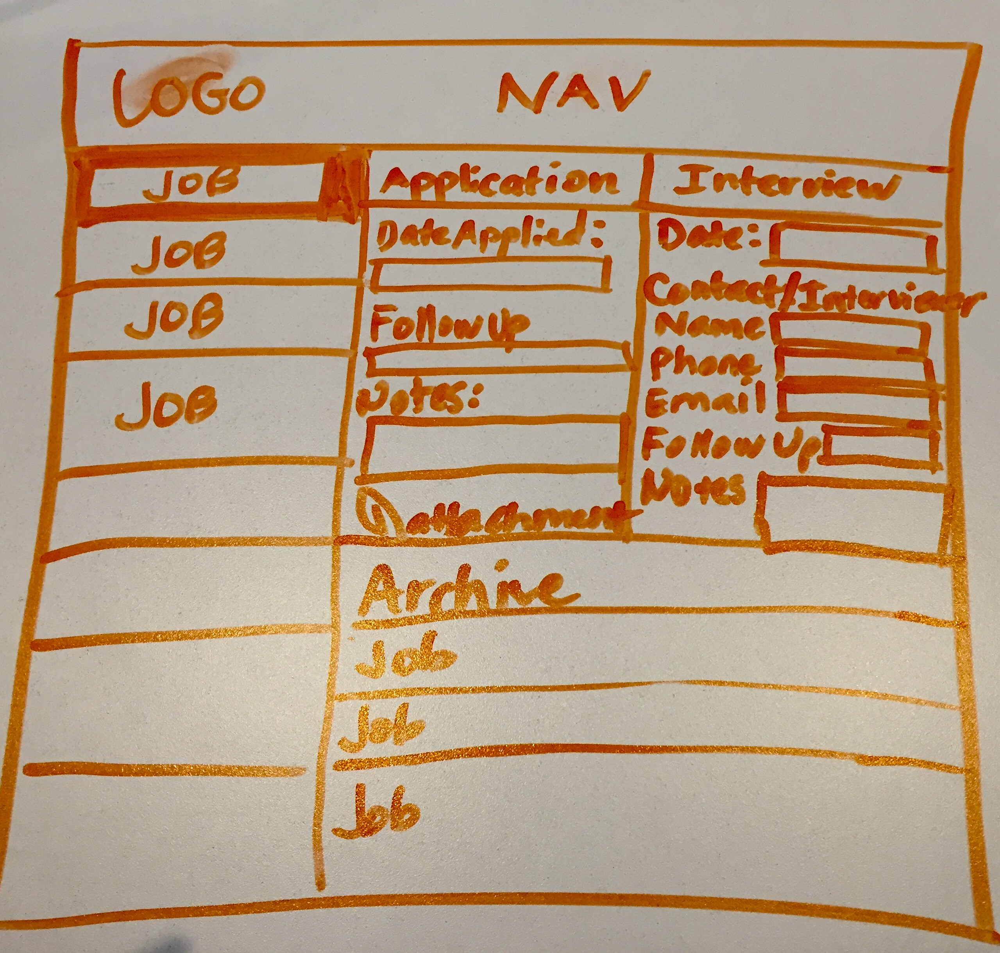
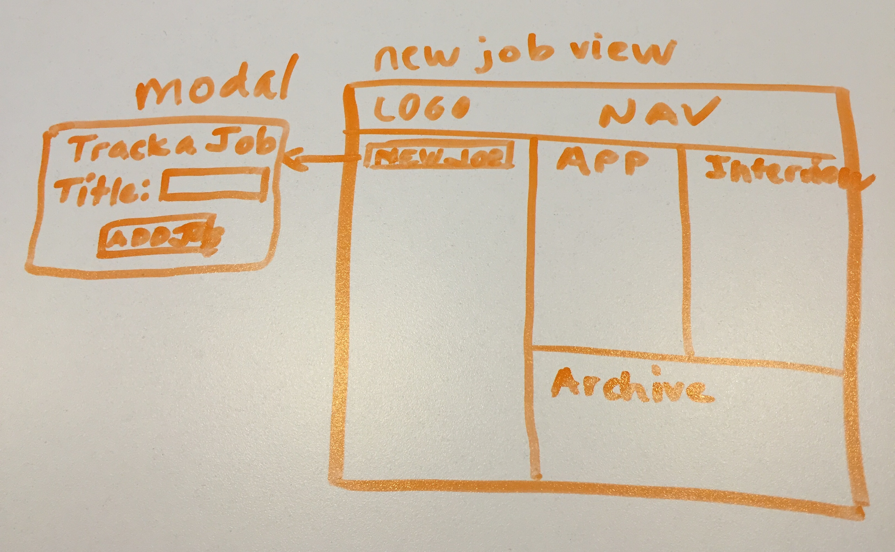
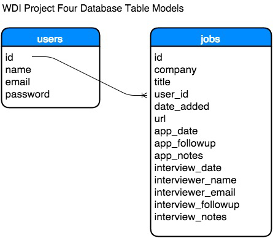

#WDI Project Four

##Description
  The objective was to create a CRUD application that can be used to track the status of each job a user applies to, from the date application was made, follow-up and management of interview data.  The original intention was to create a single page application, however, this application was built exclusively in Rails and only simulates a SPA feel.

##Artifacts

####User Stories
Users Can Do the Following:
1. Create an account
2. Login to account
3. See all jobs being tracked
4. Add jobs to track
5. Update details about job being tracked
6. Delete a job no longer being tracked


####Front-end Wireframes




####Pseudocode
User hits main index route and is prompted to login or create an account and then login
Server needs to check that the email and password entered matches what is stored in database
If a match, set session to true
Else redirect back to login

Once logged in, user will see **User Account Template View**

##User Account Template View
Has four panels: Jobs, Applications, Interviews, Archive

###Jobs: Create New Job Feature
when "track new job" button is clicked
a modal will pop up with a company field and a job title field
user submits and job is saved to database and listed in Jobs column
Jobs will be sorted by date they are added
(going to experiment with jQuery UI allowing jobs to be archived by drag & drop to Archive box)

When a job in the list is selected the panels to right (Application & Interview)
will "show" all relevant data for that job.

###Jobs: Application Panel Options
A user can add any of the following data: <br />
1. a date that application was sent
2. a date to follow up regarding application
3. any notes about the application
4. **Bonus** add attachments for cover letter and resume
Once all info has been recorded, user can click the "Save Details" button
and it will fire update to database.

####Routes
```
Prefix Verb   URI Pattern                        Controller#Action
        root GET    /                                  welcome#index
   user_jobs GET    /users/:user_id/jobs(.:format)     jobs#index
             POST   /users/:user_id/jobs(.:format)     jobs#create
new_user_job GET    /users/:user_id/jobs/new(.:format) jobs#new
    edit_job GET    /jobs/:id/edit(.:format)           jobs#edit
         job GET    /jobs/:id(.:format)                jobs#show
             PATCH  /jobs/:id(.:format)                jobs#update
             PUT    /jobs/:id(.:format)                jobs#update
             DELETE /jobs/:id(.:format)                jobs#destroy
       users GET    /users(.:format)                   users#index
             POST   /users(.:format)                   users#create
    new_user GET    /users/new(.:format)               users#new
   edit_user GET    /users/:id/edit(.:format)          users#edit
        user GET    /users/:id(.:format)               users#show
             PATCH  /users/:id(.:format)               users#update
             PUT    /users/:id(.:format)               users#update
             DELETE /users/:id(.:format)               users#destroy
sessions_new GET    /sessions/new(.:format)            sessions#new
    sessions POST   /sessions(.:format)                sessions#create
             DELETE /sessions(.:format)                sessions#destroy
```
####Database Design

